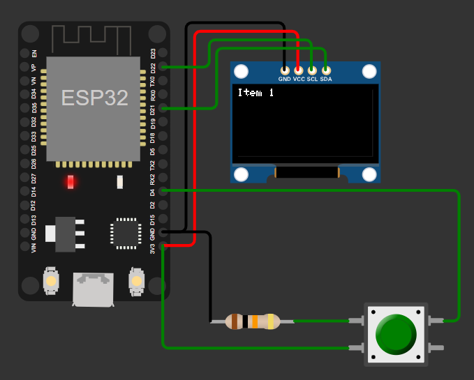

# Tổng quan
<p align="center">
  <b>Sơ đồ nối chân</b><br>
  
</p>

</p>

# Kết quả 
# Cài đặt môi trường chạy venv 
<p align="center">
  <b>Sơ đồ nối chân</b><br>
  
</p>
<p align="center">
  <b>Sơ đồ nối chân</b><br>
  
</p>
# Preprocesscing với dữ liệu mới 
```python src/align_dataset_mtcnn.py  Dataset/FaceData/raw Dataset/FaceData/processed --image_size 160 --margin 32  --random_order --gpu_memory_fraction 0.25```

# Tiến hành train
```python src/classifier.py TRAIN Dataset/FaceData/processed Models/20180402-114759.pb Models/facemodel.pkl --batch_size 1000```
