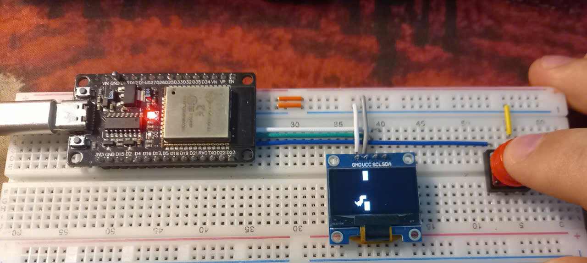
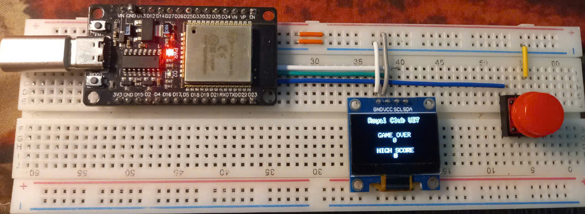

# Tổng quan
<p align="center">
  <b>Sơ đồ nối chân</b><br>
  
</p>

</p>

# Kết quả 
<p align="center">
  <b></b><br>
  
</p>
<p align="center">
  <b></b><br>
  
</p>

# Thay đổi nhân vật với cách vẽ bitmap bất kỳ 
```https://mischianti.org/ssd1306-oled-display-draw-images-splash-and-animations-2/```
